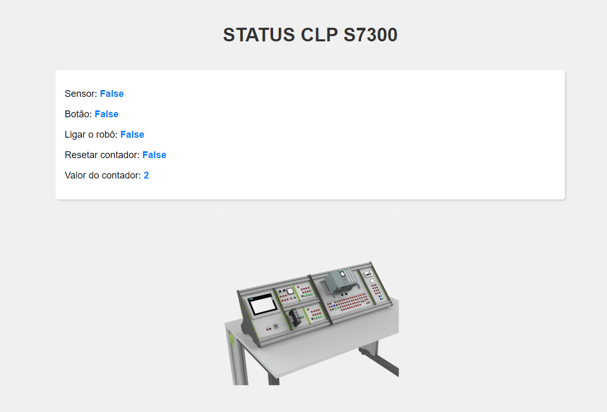

# CLP Monitoring API

A API de Monitoramento CLP é uma aplicação desenvolvida em Django para monitorar dispositivos CLP S7300 de um sistema de automação industrial. Esta API fornece funcionalidades para acessar e controlar os dispositivos conectados ao CLP.

### Endpoints Disponíveis

- `/api/`: CRUD
- `/last/`: exibir somente o estado atual do CLP

### Preview
